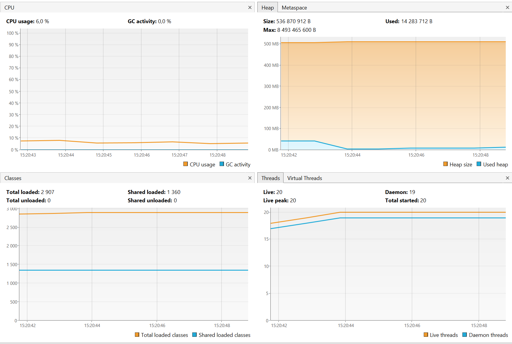
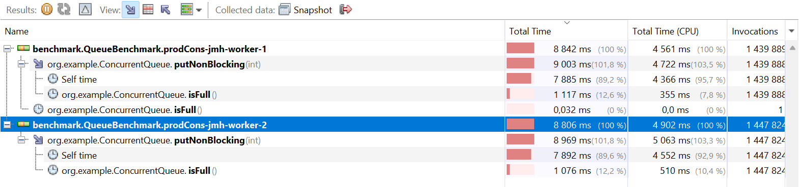
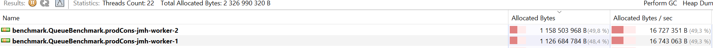
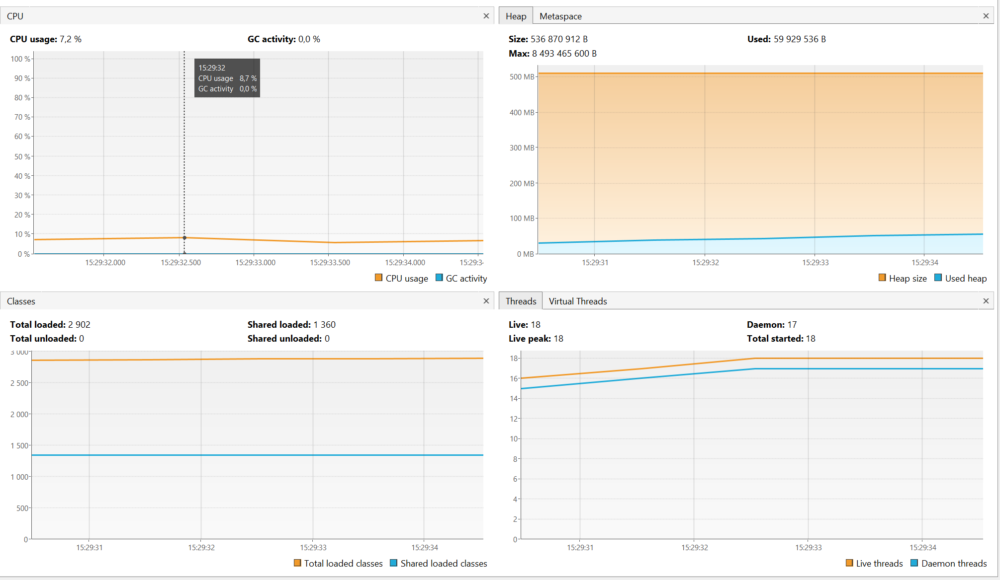
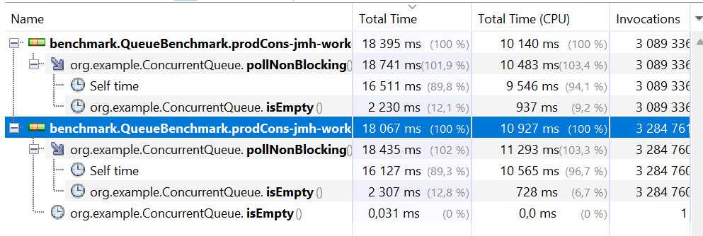
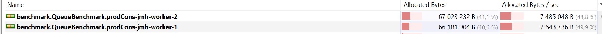

# Лабораторная работа 2. Блокирующая очередь с заданным числом элементов
## ArrayBlockingQueue

структура данных, представляющая FIFO очередь для работы в многопоточном режиме. 

Очередь поддерживает стандартные операции: pull(), poll(), peek(). Работа с многопоточностью достигается за счет установки lock при изменении состоянии объекта в каком-либо из потоков. 

##Реализация
Кастомная реализация ориентирована на работу с массивом integer и практически ничем не отличается от стандартной реализации java ArrayBlockingQueue: основана на захвате ReentrantLock при добавлении или удалении элементов. Для корректной обработки ситуаций, когда очередь заполнена и нельзя добавить новый элемент или, наоборот, когда очередь пуста, невозможно достать элемент из нее - используем Condition: поток "засыпает" в случае poll() до появления элементов в очереди; в случае put() до появления места, удаления элемента из очереди.

Тестирования реализовано на основании Lincheck, для чего были добавлены неблокирующие методы, которые если очередь заполнена или пуста возвращают null при вызове соответствующих методов. Данная мера понадобилась для исключения зависания потоков за счет того, что при тестировании ModelCheckingOptions проверяются все возможные комбинации запусков, что может вызвать ситуацию, когда вызваны только pol() и не вызван впоследствии put() не одним из потоков -> в результате потоки зависают.

##Бенчмарки:

##Профилирование 

###put()

##poll()

